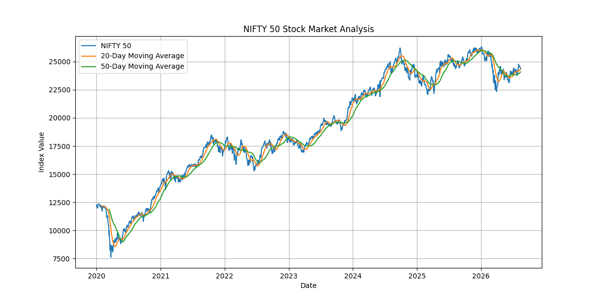
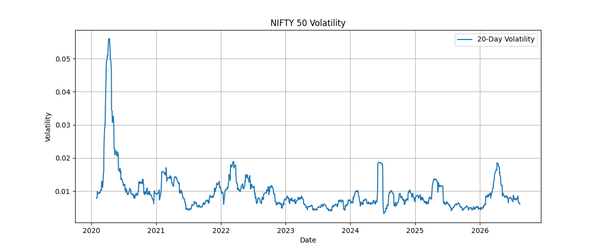

# 📊 NIFTY 50 Stock Market Analysis Dashboard

## 📌 Project Overview

The **NIFTY 50 Stock Market Analysis Dashboard** is a Python-based financial data analysis project developed to study the performance, trends, returns, and volatility of the NIFTY 50 index.

The project uses historical NIFTY 50 market data obtained through **Yahoo Finance** and applies financial data analysis techniques to calculate moving averages, daily returns, and market volatility. The results are visualized using Matplotlib to make market trends easier to understand.

---

## 🎯 Project Objective

The main objective of this project is to demonstrate how Python can be used for **financial data collection, analysis, visualization, and interpretation**.

It helps analyze NIFTY 50 price movements and identify changes in market trends and volatility.

---

## 🛠️ Technologies Used

- **Python** – Programming and financial data analysis
- **yFinance** – Downloading historical NIFTY 50 market data
- **Pandas** – Data cleaning, manipulation, and analysis
- **NumPy** – Numerical and statistical calculations
- **Matplotlib** – Financial data visualization

---

## 📈 Features

- Download historical NIFTY 50 market data
- Calculate **20-day Moving Average**
- Calculate **50-day Moving Average**
- Calculate **Daily Returns**
- Calculate **20-day Rolling Volatility**
- Identify maximum and minimum NIFTY 50 values
- Calculate average daily returns
- Calculate average market volatility
- Visualize NIFTY 50 price trends
- Visualize market volatility
- Export processed data to CSV format

---

## 📊 Financial Analysis

### 1. Moving Average Analysis

The project calculates 20-day and 50-day moving averages to identify short-term and medium-term market trends.

Moving averages help reduce short-term price fluctuations and provide a clearer view of the overall market direction.

### 2. Daily Return Analysis

Daily percentage returns are calculated to measure the day-to-day change in the NIFTY 50 index.

This helps understand the daily performance of the market and provides the basis for volatility analysis.

### 3. Volatility Analysis

A 20-day rolling standard deviation of daily returns is calculated to measure market volatility.

Higher volatility indicates larger price fluctuations and potentially higher market risk, while lower volatility indicates relatively stable price movements.

---

## 📷 Visualizations

### NIFTY 50 Price Trend

The chart below displays the NIFTY 50 closing price along with its 20-day and 50-day moving averages.



### NIFTY 50 Volatility

The chart below displays the 20-day rolling volatility of NIFTY 50 daily returns.



---

## 📁 Project Structure

```text
NIFTY50-Stock-Market-Dashboard/
│
├── stock_analysis.py
├── requirements.txt
├── README.md
├── nifty50_analysis.csv
├── nifty50_price_chart.png
└── nifty50_volatility_chart.png


